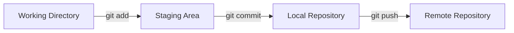

# Git Commit and Push Tutorial

A comprehensive guide to committing and pushing your code changes to a remote repository.

---

## Table of Contents

1. [Prerequisites](#prerequisites)
2. [Understanding the Git Workflow](#understanding-the-git-workflow)
3. [Step-by-Step Guide](#step-by-step-guide)
4. [Common Scenarios](#common-scenarios)
5. [Best Practices](#best-practices)
6. [Troubleshooting](#troubleshooting)

---

## Prerequisites

Before you begin, ensure you have:

- Git installed on your system (`git --version` to check)
- A Git repository initialized (local or cloned from remote)
- A remote repository configured (e.g., on GitHub, GitLab, Bitbucket)

---

## Understanding the Git Workflow

Git uses a three-stage workflow:



1. **Working Directory**: Where you make changes to your files
2. **Staging Area**: Where you prepare changes for commit
3. **Local Repository**: Your local Git history
4. **Remote Repository**: The shared repository (GitHub, GitLab, etc.)

---

## Step-by-Step Guide

### Step 1: Check Your Current Status

Before making any commits, check what changes you have:

```bash
git status
```

This shows:
- Modified files (in red)
- Staged files (in green)
- Untracked files
- Current branch

### Step 2: Stage Your Changes

You have several options for staging files:

**Stage specific files:**
```bash
git add filename.txt
git add folder/file.go
```

**Stage all modified and new files:**
```bash
git add .
```

**Stage all files including deletions:**
```bash
git add -A
```

**Stage only modified files (not new files):**
```bash
git add -u
```

**Interactive staging (choose what to stage):**
```bash
git add -p
```

### Step 3: Verify Staged Changes

Check what you've staged:

```bash
git status
```

Review the actual changes:

```bash
git diff --staged
```

### Step 4: Commit Your Changes

Create a commit with a descriptive message:

**Simple commit:**
```bash
git commit -m "Add user authentication feature"
```

**Commit with detailed description:**
```bash
git commit -m "Add user authentication feature" -m "Implemented JWT-based authentication with login and logout endpoints. Added middleware for protected routes."
```

**Open editor for longer message:**
```bash
git commit
```

> [!TIP]
> Write clear, descriptive commit messages. A good format is:
> - First line: Brief summary (50 characters or less)
> - Blank line
> - Detailed description (if needed)

### Step 5: Push to Remote Repository

**Push to the current branch:**
```bash
git push
```

**Push and set upstream (first time):**
```bash
git push -u origin main
```

**Push to specific branch:**
```bash
git push origin branch-name
```

**Force push (use with caution!):**
```bash
git push --force
```

> [!CAUTION]
> Use `--force` only when absolutely necessary, as it can overwrite remote history and affect other collaborators.

---

## Common Scenarios

### Scenario 1: First Time Pushing a New Branch

```bash
# Create and switch to new branch
git checkout -b feature/new-feature

# Make changes and stage them
git add .

# Commit changes
git commit -m "Implement new feature"

# Push and set upstream
git push -u origin feature/new-feature
```

### Scenario 2: Amending the Last Commit

If you forgot to include something in your last commit:

```bash
# Stage the forgotten changes
git add forgotten-file.txt

# Amend the previous commit
git commit --amend --no-edit

# Force push (if already pushed)
git push --force
```

### Scenario 3: Committing Only Part of a File

```bash
# Interactively stage parts of files
git add -p filename.txt

# Commit the staged changes
git commit -m "Partial update to filename"
```

### Scenario 4: Undoing Staged Changes

```bash
# Unstage specific file
git reset HEAD filename.txt

# Unstage all files
git reset HEAD
```

### Scenario 5: Working with Multiple Commits

```bash
# Make first set of changes
git add file1.txt
git commit -m "Update file1"

# Make second set of changes
git add file2.txt
git commit -m "Update file2"

# Push all commits at once
git push
```

---

## Best Practices

### Commit Message Guidelines

**Good commit messages:**
```
✓ Add user registration endpoint
✓ Fix memory leak in image processing
✓ Refactor database connection logic
✓ Update dependencies to latest versions
```

**Poor commit messages:**
```
✗ Fixed stuff
✗ WIP
✗ asdfasdf
✗ Updated files
```

### Conventional Commits

Consider using the [Conventional Commits](https://www.conventionalcommits.org/) format:

```bash
git commit -m "feat: add user profile page"
git commit -m "fix: resolve login timeout issue"
git commit -m "docs: update API documentation"
git commit -m "refactor: simplify authentication logic"
git commit -m "test: add unit tests for user service"
```

**Common prefixes:**
- `feat`: New feature
- `fix`: Bug fix
- `docs`: Documentation changes
- `style`: Code formatting (no logic change)
- `refactor`: Code restructuring
- `test`: Adding or updating tests
- `chore`: Maintenance tasks

### Commit Frequency

> [!IMPORTANT]
> - Commit often with logical, atomic changes
> - Each commit should represent a single logical change
> - Don't commit broken code to main/master branch
> - Use feature branches for experimental work

### Before Pushing

**Always check before pushing:**

1. **Review your changes:**
   ```bash
   git log --oneline -5
   git diff origin/main
   ```

2. **Pull latest changes:**
   ```bash
   git pull --rebase
   ```

3. **Run tests:**
   ```bash
   # Run your project's test suite
   npm test  # or pytest, go test, etc.
   ```

---

## Troubleshooting

### Issue: "Updates were rejected because the tip of your current branch is behind"

**Solution:** Pull and merge/rebase first:

```bash
# Option 1: Merge
git pull origin main

# Option 2: Rebase (cleaner history)
git pull --rebase origin main

# Then push
git push
```

### Issue: "fatal: The current branch has no upstream branch"

**Solution:** Set upstream when pushing:

```bash
git push -u origin branch-name
```

### Issue: Accidentally committed to wrong branch

**Solution:** Move commit to correct branch:

```bash
# Note the commit hash
git log --oneline -1

# Switch to correct branch
git checkout correct-branch

# Cherry-pick the commit
git cherry-pick <commit-hash>

# Switch back and reset
git checkout wrong-branch
git reset --hard HEAD~1
```

### Issue: Need to undo last commit (not pushed)

**Solution:**

```bash
# Keep changes in working directory
git reset --soft HEAD~1

# Discard changes completely
git reset --hard HEAD~1
```

### Issue: Merge conflicts after pull

**Solution:**

```bash
# Pull and see conflicts
git pull

# Fix conflicts in files, then:
git add .
git commit -m "Resolve merge conflicts"
git push
```

---

## Quick Reference

| Command | Description |
|---------|-------------|
| `git status` | Check current state |
| `git add <file>` | Stage specific file |
| `git add .` | Stage all changes |
| `git commit -m "message"` | Commit with message |
| `git push` | Push to remote |
| `git push -u origin <branch>` | Push and set upstream |
| `git log` | View commit history |
| `git diff` | View unstaged changes |
| `git diff --staged` | View staged changes |
| `git reset HEAD <file>` | Unstage file |
| `git commit --amend` | Modify last commit |
| `git pull` | Fetch and merge from remote |
| `git pull --rebase` | Fetch and rebase from remote |

---

## Complete Workflow Example

Here's a complete example workflow:

```bash
# 1. Check current status
git status

# 2. Create a new feature branch
git checkout -b feature/add-login

# 3. Make your code changes
# ... edit files ...

# 4. Check what changed
git status
git diff

# 5. Stage your changes
git add src/auth/login.go
git add src/auth/login_test.go

# 6. Verify staged changes
git status
git diff --staged

# 7. Commit with descriptive message
git commit -m "feat: implement user login functionality" -m "Added login endpoint with JWT authentication and rate limiting"

# 8. Pull latest changes from main
git checkout main
git pull
git checkout feature/add-login

# 9. Rebase on main (optional, for cleaner history)
git rebase main

# 10. Push to remote
git push -u origin feature/add-login

# 11. Create pull request on GitHub/GitLab
# (done via web interface)
```

---

## Additional Resources

- [Official Git Documentation](https://git-scm.com/doc)
- [GitHub Git Guides](https://github.com/git-guides)
- [Atlassian Git Tutorials](https://www.atlassian.com/git/tutorials)
- [Interactive Git Branching Tutorial](https://learngitbranching.js.org/)

---

> [!NOTE]
> This tutorial covers the most common git commit and push scenarios. For advanced topics like rebasing, cherry-picking, and complex merge strategies, refer to the official Git documentation.
